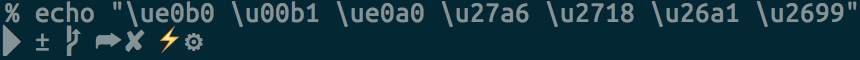

### What

## Setup instructions

1. `cat install.sh | sh`. This should hopefully work.
2. Change shell: `fish` using `chsh -s $(which fish)`. You might have to add `/opt/homebrew/bin/fish` to `/etc/shells` for this to work: `sudo echo /opt/homebrew/bin/fish >> /etc/shells`.
3. Set iterm2 theme.
4. Debug colors, syntax highlighting etc

Bonus: If you are using PGP and have your GPG key stored on Keybase, follow check out this guide: https://blog.scottlowe.org/2017/09/06/using-keybase-gpg-macos/

## Recommendations

- Authenticate with Github using their CLI (`gh`), this is a lot easier than generating and setting SSH keys.

## What's installed?

1. [Brew](https://brew.sh/) package manager
2. [Fish shell](https://fishshell.com/) with a few plugins (installed with Fisher)
3. [Starship](https://starship.rs/) prompt
4. A few essential MacOS applications
5. A few [Nerd Fonts](https://www.nerdfonts.com/)

## What's configured?

1. Good MacOS defaults
2. Fish shell (with symlinks)
3. Git and `.gitignore` (with symlinks)
4. Vim (with symlinks)

See the `.txt` files in `/requirements/` for a list of software that's installed.

## Fonts

- Vscode: Dank Mono, FiraCode Nerd Font, Menlo, Monaco, Courier New, monospace
- iTerm: FiraCode Nerd Font Mono

Note: Only Dank mono is included in this repo. You need to install the others separately:

- https://github.com/ryanoasis/nerd-fonts/tree/master/patched-fonts/FiraCode

`cat setup-gpg.sh | sh`

### Troubleshooting

- Is is something wrong with the fonts? Try `echo "\ue0b0 \u00b1 \ue0a0 \u27a6 \u2718 \u26a1 \u2699"`. This should look like this 
